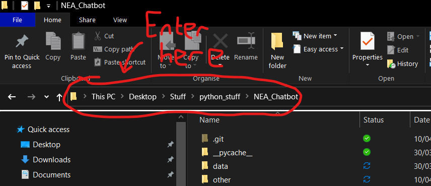

# Basic chatbot using BlenderBot 2.0 and Flask

## Installation instructions

1. download the code as a zip file
2. extract the zip file
3. open the command line in the program's folder. To do this enter `powershell` into the file explorer address bar 
4. enter the following command: `pip install -r requirements.txt`
5. run app.py. Either enter `python app.py` into the PowerShell window from before or double-click on the app.py file
