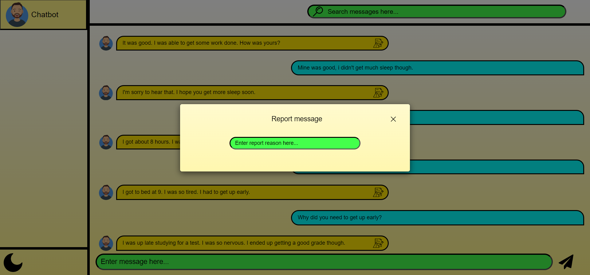
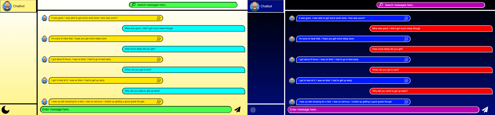

# Basic chatbot using BlenderBot 2.0 and Flask

## Requirements

* Windows (this program is currently untested on other operating systems)
* Python version 3.9.9 (untested on other versions) (download from [here](https://www.python.org/downloads/release/python-399/ "Download the Windows installer (64-bit)"))
* Command-line access
* Up-to-date web browser such as Google Chrome or Firefox
* Whilst there are no designated system requirements, the program will work faster and perform better with higher clock speed CPUs

## Features

* An AI capable of holding a conversation on a broad range of general topics
* A search feature, allowing users to search for a previous message and find the context surrounding it 
* A reporting feature, allowing users to report select messages along with a reason as to why, which will then be logged in a seperate file 
* A seperate light and dark mode 
* AI changes complexity depending on the performance of the system
* Basic grammar checker on user and AI messages

## Limitations

* The AI does not take into account any context, only using the submitted message

## Installation instructions

1. download the code as a zip file
2. extract the zip file
3. open the command line in the program's folder. To do this enter `powershell` into the file explorer address bar 
4. enter the following command: `pip install -r requirements.txt`
5. run app.py. Either enter `python app.py` into the PowerShell window from before or double-click on the app.py file
